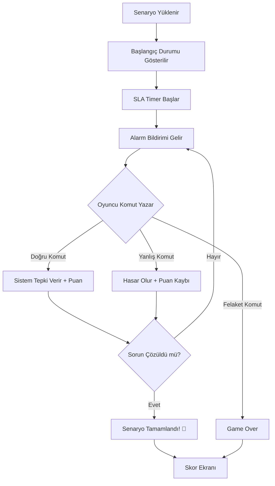

# 🚨 DevOps Simulator: Outage Crisis

> **Bir bankanın sistem odasında hayatta kal. Alarmları çöz. Sistemi ayakta tut.**

---

## 🎯 Oyun Özeti

Oyuncu, büyük bir bankanın (DenizBank benzeri) **DevOps mühendisi** rolünde. Gece vardiyasında aniden sistemler çökmeye başlıyor. Kubernetes podları restart döngüsüne giriyor, disk alanları doluyor, servisler birbirine bağımlı şekilde çöküyor. Oyuncu, terminal üzerinden komutlar yazarak sistemleri kurtarmaya çalışıyor.

**Hedef Kitle:** DevOps/SRE mühendisleri, sistem yöneticileri, Kubernetes öğrenen profesyoneller.

---

## 🏗️ Oyun Mekanikleri

### Temel Döngü
```
[ALARM GELİR] → [OYUNCU DURUMU ANALİZ EDER] → [KOMUT YAZAR] → [SİSTEM TEPKİ VERİR] → [SKOR GÜNCELLENIR]
```

### Senaryo Yapısı

Her oyun bir **"Kriz Senaryosu"** etrafında döner. Senaryolar zorluk seviyesine göre sıralanır:

| Seviye | Senaryo | Zorluk |
|--------|---------|--------|
| 🟢 Level 1 | Pod CrashLoopBackOff | Kolay |
| 🟢 Level 2 | PVC %95 Dolu - Disk Temizliği | Kolay |
| 🟡 Level 3 | Service Mesh Bağlantı Kopması | Orta |
| 🟡 Level 4 | Database Replication Lag | Orta |
| 🟡 Level 5 | Ingress Controller Çökmesi | Orta |
| 🔴 Level 6 | Full Cluster Node Failure | Zor |
| 🔴 Level 7 | Cascading Service Failure | Zor |
| 🔴 Level 8 | DNS + CoreDNS Çökmesi | Zor |
| ⚫ Level 9 | Ransomware Saldırısı (DR Senaryosu) | Uzman |
| ⚫ Level 10 | Tam Data Center Failover | Uzman |

### Komut Sistemi

Oyuncu gerçek dünya komutlarına benzer komutlar kullanır:

```bash
# Durum Kontrol
kubectl get pods -n banking-core
kubectl describe pod payment-service-7d8f9-abc12
kubectl logs payment-service-7d8f9-abc12 --tail=50

# Müdahale
kubectl rollout restart deployment/payment-service -n banking-core
kubectl scale deployment/payment-service --replicas=3
kubectl delete pod payment-service-7d8f9-abc12 --force

# Disk Yönetimi
df -h /var/lib/containers
du -sh /var/log/*
kubectl exec -it db-pod -- pg_dump --clean

# Ağ Teşhis
kubectl get svc -n banking-core
kubectl get ingress -A
curl -k https://payment-api.internal/health
```

### Puan Sistemi

| Metrik | Açıklama |
|--------|----------|
| ⏱️ **Zaman** | Ne kadar hızlı çözdün? (SLA timer aktif) |
| 🎯 **Doğruluk** | Doğru komutları kullandın mı? |
| 💥 **Hasar** | Yanlış komutlarla daha fazla hasar verdin mi? |
| 📊 **Uptime** | Servislerin toplam çalışma süresi |
| 🧠 **Analiz** | Root-cause'u doğru tespit ettin mi? |

### SLA Mekanizması
```
┌─────────────────────────────────────────────┐
│  🏦 BANKING CORE SYSTEMS - SLA DASHBOARD    │
│─────────────────────────────────────────────│
│  Payment Service:    ██████████░░  83%  ⚠️  │
│  Auth Service:       ████████████  100% ✅  │
│  Core Banking:       ███████░░░░░  58%  🔴  │
│  Mobile API:         █████████░░░  75%  ⚠️  │
│                                             │
│  Overall SLA:        78.2%    Target: 99.9% │
│  Time Remaining:     00:12:34               │
│  Customer Impact:    1,247 users affected    │
└─────────────────────────────────────────────┘
```

---

## 🖥️ Kullanıcı Arayüzü Tasarımı

### Ana Ekran Bileşenleri

```
┌──────────────────────────────────────────────────────────────────┐
│  🚨 DEVOPS SIMULATOR: OUTAGE CRISIS          [Score: 2450]      │
│══════════════════════════════════════════════════════════════════│
│                                                                  │
│  ┌─────────────────────────┐  ┌───────────────────────────────┐ │
│  │  📊 SYSTEM STATUS       │  │  🔔 ALERTS                    │ │
│  │                         │  │                               │ │
│  │  CPU:  ████████░░ 82%   │  │  [CRITICAL] payment-svc       │ │
│  │  MEM:  ██████░░░░ 64%   │  │  CrashLoopBackOff 5m ago     │ │
│  │  DISK: █████████░ 94%   │  │                               │ │
│  │  NET:  ████░░░░░░ 38%   │  │  [WARNING] disk /var/lib      │ │
│  │                         │  │  Usage at 94% threshold       │ │
│  │  Pods: 12/15 Running    │  │                               │ │
│  │  Nodes: 3/3 Ready       │  │  [INFO] scaling event         │ │
│  │                         │  │  HPA triggered for api-gw     │ │
│  └─────────────────────────┘  └───────────────────────────────┘ │
│                                                                  │
│  ┌──────────────────────────────────────────────────────────────┐│
│  │  💻 TERMINAL                                                ││
│  │  root@bank-ops:~$ kubectl get pods -n banking-core          ││
│  │  NAME                        READY   STATUS             AGE ││
│  │  payment-svc-7d8f9-abc12     0/1     CrashLoopBackOff   5m ││
│  │  auth-svc-4b2e1-def34        1/1     Running            2d ││
│  │  core-bank-9a7c3-ghi56       1/1     Running            2d ││
│  │  mobile-api-2f5d8-jkl78      1/1     Running            1d ││
│  │                                                             ││
│  │  root@bank-ops:~$ █                                         ││
│  └──────────────────────────────────────────────────────────────┘│
│                                                                  │
│  ┌──────────────────────────────────────────────────────────────┐│
│  │  📋 MISSION: Payment servisini 10 dakika içinde kurtarın!   ││
│  │  ⏱️ Kalan Süre: 07:23  |  💰 Etkilenen Müşteri: 1,247      ││
│  └──────────────────────────────────────────────────────────────┘│
└──────────────────────────────────────────────────────────────────┘
```

### Ekran Bölümleri

1. **Üst Bar:** Skor, Level, Oyuncu Adı
2. **Sol Panel - System Status:** CPU, Memory, Disk, Network metrikleri (canlı animasyonlu bar'lar)
3. **Sağ Panel - Alerts:** Kronolojik alarm listesi (Critical/Warning/Info renk kodlu)
4. **Merkez - Terminal:** Komut girişi ve çıktı alanı (gerçek terminal hissi)
5. **Alt Bar - Mission:** Aktif görev, kalan süre, etkilenen kullanıcı sayısı

---

## 🧩 Teknik Mimari (Faz 1 - AI'sız)

### Teknoloji Seçimi

| Bileşen | Teknoloji | Neden? |
|---------|-----------|--------|
| Frontend | HTML + CSS + Vanilla JS | Hızlı, bağımlılık yok |
| Terminal Emülasyonu | xterm.js | Gerçek terminal deneyimi |
| Senaryo Motoru | JSON tabanlı state machine | Basit, genişletilebilir |
| Ses Efektleri | Web Audio API | Alarm sesleri, typing sound |
| Veri Saklama | LocalStorage | İlerleme, highscore |

### Mimari Diyagram

```
┌─────────────────────────────────────────────────┐
│                  BROWSER                         │
│                                                  │
│  ┌──────────┐  ┌──────────┐  ┌───────────────┐  │
│  │  UI       │  │ Terminal  │  │  Senaryo      │  │
│  │  Engine   │←→│ Emulator  │←→│  Engine       │  │
│  │ (CSS+JS)  │  │(xterm.js) │  │ (State        │  │
│  │           │  │           │  │  Machine)     │  │
│  └──────────┘  └──────────┘  └───────┬───────┘  │
│                                      │           │
│                              ┌───────▼───────┐   │
│                              │  Komut        │   │
│                              │  Parser       │   │
│                              │  & Validator  │   │
│                              └───────┬───────┘   │
│                                      │           │
│                              ┌───────▼───────┐   │
│                              │  Senaryo      │   │
│                              │  JSON Files   │   │
│                              └───────────────┘   │
│                                                  │
│  ┌──────────────────────────────────────────┐    │
│  │  LocalStorage: Scores, Progress, Config  │    │
│  └──────────────────────────────────────────┘    │
└─────────────────────────────────────────────────┘
```

### Senaryo JSON Formatı

```json
{
  "id": "scenario_001",
  "title": "Payment Service Çökmesi",
  "difficulty": "easy",
  "timeLimit": 600,
  "description": "Payment servisi CrashLoopBackOff'a girdi. Müşteriler ödeme yapamıyor.",
  
  "initialState": {
    "pods": [
      { "name": "payment-svc-7d8f9-abc12", "status": "CrashLoopBackOff", "restarts": 5, "namespace": "banking-core" },
      { "name": "auth-svc-4b2e1-def34", "status": "Running", "restarts": 0, "namespace": "banking-core" }
    ],
    "nodes": [
      { "name": "node-01", "status": "Ready", "cpu": "82%", "memory": "64%" }
    ],
    "alerts": [
      { "severity": "critical", "message": "payment-svc CrashLoopBackOff", "timestamp": -300 }
    ],
    "metrics": {
      "cpu": 82, "memory": 64, "disk": 45, "network": 38
    }
  },

  "rootCause": "OOMKilled - Memory limit 256Mi çok düşük ayarlanmış",
  
  "expectedCommands": [
    {
      "pattern": "kubectl get pods -n banking-core",
      "response": "Pod listesini gösterir",
      "points": 10,
      "hint": "Önce podların durumuna bak"
    },
    {
      "pattern": "kubectl describe pod payment-svc*",
      "response": "OOMKilled detayını gösterir",
      "points": 20,
      "hint": "Pod'un neden çöktüğünü anlamak için describe kullan",
      "revealsRootCause": true
    },
    {
      "pattern": "kubectl edit deployment/payment-svc*",
      "response": "Memory limit'i düzenleme ekranı",
      "points": 30,
      "isSolution": true
    }
  ],

  "wrongCommands": [
    {
      "pattern": "kubectl delete pod payment-svc* --force",
      "consequence": "Pod silindi ama aynı sorunla tekrar geldi. -20 puan.",
      "points": -20,
      "slaImpact": -5
    },
    {
      "pattern": "kubectl delete namespace banking-core",
      "consequence": "⚠️ TÜM BANKING SERVİSLERİ SİLİNDİ! Felaket! -500 puan.",
      "points": -500,
      "slaImpact": -50,
      "gameOver": true
    }
  ],

  "successCondition": {
    "type": "pod_running",
    "target": "payment-svc",
    "message": "🎉 Tebrikler! Payment servisi tekrar çalışıyor. Müşteriler ödeme yapabiliyor."
  }
}
```

---

## 🎮 Oyun Akışı

### 1. Ana Menü
```
╔══════════════════════════════════════════════════╗
║                                                  ║
║     ██████╗ ███████╗██╗   ██╗ ██████╗ ██████╗    ║
║     ██╔══██╗██╔════╝██║   ██║██╔═══██╗██╔══██╗   ║
║     ██║  ██║█████╗  ██║   ██║██║   ██║██████╔╝   ║
║     ██║  ██║██╔══╝  ╚██╗ ██╔╝██║   ██║██╔═══╝    ║
║     ██████╔╝███████╗ ╚████╔╝ ╚██████╔╝██║        ║
║     ╚═════╝ ╚══════╝  ╚═══╝   ╚═════╝ ╚═╝        ║
║                                                  ║
║           ⚡ OUTAGE CRISIS SIMULATOR ⚡           ║
║                                                  ║
║         [1] 🎮  Yeni Oyun Başlat                 ║
║         [2] 📋  Senaryo Seç                      ║
║         [3] 🏆  Liderlik Tablosu                 ║
║         [4] ⚙️   Ayarlar                          ║
║         [5] 📖  Nasıl Oynanır?                   ║
║                                                  ║
╚══════════════════════════════════════════════════╝
```

### 2. Oyun İçi Akış



### 3. Skor Ekranı
```
┌────────────────────────────────────────────┐
│         🏆 SENARYO TAMAMLANDI!             │
│────────────────────────────────────────────│
│                                            │
│  Senaryo:     Payment Service Çökmesi      │
│  Zorluk:      ⭐ Kolay                     │
│  Süre:        03:42 / 10:00               │
│                                            │
│  ────────── SKOR DETAYI ──────────        │
│  Doğru Komutlar:    +60 puan              │
│  Hız Bonusu:        +25 puan              │
│  Root Cause Analiz: +40 puan              │
│  Hasar Cezası:      -20 puan              │
│  ─────────────────────────────            │
│  TOPLAM:            105 puan  ⭐⭐⭐        │
│                                            │
│  [Tekrar Oyna]  [Sonraki Senaryo]  [Menü] │
│                                            │
└────────────────────────────────────────────┘
```

---

## 🚀 Faz 2 - Ollama AI Entegrasyonu (Gelecek)

### AI'nın Rolü

Faz 1'de senaryolar JSON dosyalarıyla statik çalışır. Faz 2'de Ollama entegrasyonuyla:

| Özellik | Açıklama |
|---------|----------|
| **Dinamik Senaryolar** | AI her seferinde farklı bir kriz üretir |
| **Akıllı Tepki** | Oyuncunun komutlarına gerçekçi terminal çıktısı üretir |
| **Hint Sistemi** | Oyuncu takılınca AI ipucu verir |
| **Değerlendirme** | Oyuncunun performansını analiz eder ve önerilerde bulunur |
| **Storyline** | Her senaryo arasında hikaye bağlantısı kurar |

### Ollama API Kullanımı

```
┌─────────────────┐         ┌──────────────────┐
│   Web Arayüzü   │ ──API──→│  Ollama (Yerel)  │
│   (Browser)     │←──JSON──│  Llama-3 / Mistral│
│                 │         │  localhost:11434  │
└─────────────────┘         └──────────────────┘
```

```javascript
// Örnek API çağrısı
async function getAIResponse(playerCommand, gameState) {
  const response = await fetch('http://localhost:11434/api/generate', {
    method: 'POST',
    body: JSON.stringify({
      model: 'llama3',
      prompt: `Sen bir Kubernetes cluster'ın simülasyon motorusun.
               Mevcut durum: ${JSON.stringify(gameState)}
               Oyuncu komutu: ${playerCommand}
               Bu komutun gerçekçi çıktısını üret.`,
      stream: false
    })
  });
  return response.json();
}
```

---

## 💼 B2B Potansiyeli

### Neden Şirketler Bunu İster?

1. **Güvenlik:** Tüm veriler iç ağda kalır (Ollama + yerel hosting)
2. **Maliyet:** Lisans veya SaaS ücreti yok
3. **Özelleştirme:** Şirketin kendi altyapısına göre senaryo yazılabilir
4. **Ölçülebilir Eğitim:** Her çalışanın performansı raporlanabilir
5. **Onboarding:** Yeni DevOps mühendislerinin hızlı adapte olması

### Hedef Sektörler

- 🏦 Bankacılık & Fintech
- 📡 Telekom
- 🏥 Sağlık (hastane IT)
- 🛒 E-ticaret
- 🏛️ Kamu kurumları

---

## 📅 Geliştirme Yol Haritası

### Faz 1: Temel Oyun (AI'sız) — _Bu Aşama_
- [x] Konsept dokümanı hazırla
- [ ] Proje yapısını kur (HTML + CSS + JS)
- [ ] Terminal emülatörünü entegre et (xterm.js)
- [ ] Senaryo motoru (JSON state machine) yaz
- [ ] Komut parser & validator oluştur
- [ ] İlk 3 senaryoyu tasarla
- [ ] SLA dashboard ve metrik panellerini yap
- [ ] Puan sistemi ve skor ekranını ekle
- [ ] Ses efektleri ve animasyonlar ekle

### Faz 2: Ollama Entegrasyonu
- [ ] Ollama API bağlantısı
- [ ] Dinamik senaryo üretimi
- [ ] Akıllı komut çıktı üretimi
- [ ] AI hint sistemi
- [ ] Performans değerlendirme raporu

### Faz 3: B2B Özellikleri
- [ ] Çok oyunculu mod (ekip bazlı kriz yönetimi)
- [ ] Admin paneli (senaryo yönetimi)
- [ ] Çalışan performans raporlama
- [ ] Özel senaryo editörü
- [ ] Docker Compose ile tek komutta kurulum

---

## 🔧 Geliştirme Ortamı

| Gereksinim | Detay |
|-----------|-------|
| **Makine** | Senin mini PC'n (Home Lab) |
| **OS** | Linux/Windows |
| **Browser** | Chrome/Firefox (modern) |
| **Node.js** | v18+ (opsiyonel, dev server için) |
| **Ollama** | Faz 2 için (zaten kurulu) |
| **Maliyet** | 0 TL 🎉 |

---

> **Bir sonraki adım:** Proje yapısını oluşturup ilk çalışan prototipi yapmak!
